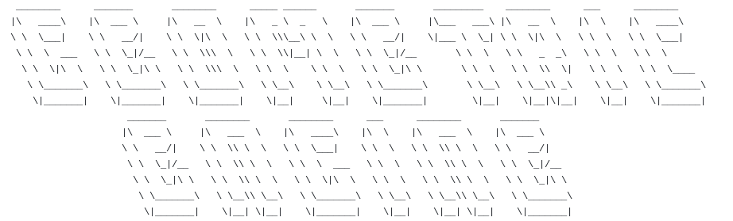
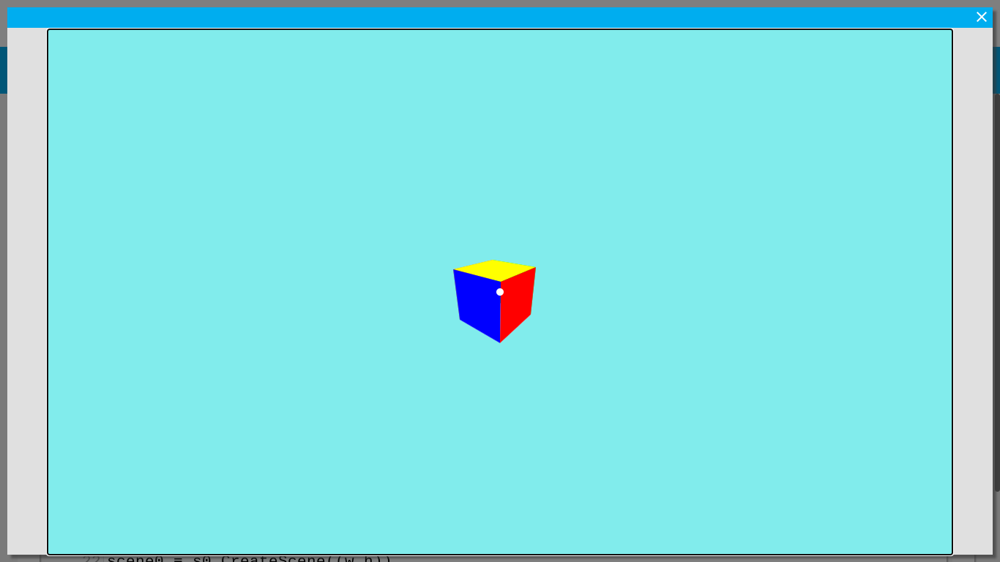

After many months of research, I've finally completed my 3D Engine! I'm now able to showcase a basic 3D Cube with layered-face ordering! Enjoy! I greatly thank all of the kind users on Stack Overflow (and the help of previously asked questions) to help aid me in getting to this point!

Controls: WASD - Move Camera | Q - Fly Up | E - Fly Down | Mouse Cursor - Look Around | R - Reset Scene | Escape - End Demo



**Hello! Welcome to the Geometric Engine!**

_This Tutorial will help you get an insight on getting started with a project in the Geometric Engine!_

**Chapter 0 : Base Vocabulary**

Before we get started on learning how everything works, it's important you know what each individual thing is used for
so you can increase your productivity throughout the Engine!

       ~ Delta Time - Helps keep a consistant time frame, whilst updating the screen
       ~ Entities ~ Fancy way of saying an object

**Chapter 1 : Camera Controller**

The base camera controller comes with 4 (user-allowed) functions:
            
            - Move
            - Rotate
            - Mouse_Controller
            - Reset

**Chapter 1.1 : The Move Function**

The `Move` function as the name states, is responsible for handling player-movement.

It takes in 4 parameters:

```
def Move(self, dt, key, flyCam=False):
```
Parameter Breakdown:

  dt - _DeltaTime_
  
  key - _reference to `var_name = pygame.get_pressed()`_ ([Learn More](https://www.pygame.org/docs/ref/key.html#pygame.key.get_pressed))
  
  flyCam - _(boolean) Enables/Disables cam fly controller_

```
while (1):
    key = pygame.key.get_pressed()
    dt = clock.tick(30) / 1000
    
    # Player Movement
    cam.Move(dt, key, False)
```
__________________________________________
**Chapter 1.2 : The Rotate Function**

The `Rotate` function allows the player to rotate the Camera when pressing the Arrow Keys.

This function takes in 3 Parameters:

```
def Rotate(self, dt, key):
```

Parameter Breakdown:
   
   dt - _Delta Time_
   
   key - _reference to `var_name = pygame.get_pressed()`_ ([Learn More](https://www.pygame.org/docs/ref/key.html#pygame.key.get_pressed))

```
while (1):
    key = pygame.key.get_pressed()
    dt = clock.tick(30) / 1000
    
    # Player Movement
    cam.Rotate(dt, key, False)
```
__________________________________________
**Chapter 1.3 : The Reset Function**

The `Rotate` function allows the player to rotate the Camera when pressing the Arrow Keys.

This function takes in 3 Parameters:

```
def Reset(self, key):
```

Parameter Breakdown:

   key - _reference to `var_name = pygame.get_pressed()`_ ([Learn More](https://www.pygame.org/docs/ref/key.html#pygame.key.get_pressed))

```
while (1):
    key = pygame.key.get_pressed()
    
    # Reset Player Controller
    cam.Reset(key)
```
__________________________________________
**CHAPTER 2 : Materials**

Materials are used in the colors and/or texturing of objects. Applying images to your objects is still being worked on,
but when it's finished we assume it'll look a little something like:

```
def apply_texture(self,src):
```
We estimate we'll use this function, and blit the texture onto the polygon scaling the image based on the player's rotation.
This should (in theory) work because since the newest version of the TechSmart Image M-porter (TIM), the objects are applied to
a _pygame.Surface([w,h])_ instance.
__________________________________________
**Chapter 3 : Scenes**

Scenes, like in a play. Are a blank canvas, you can create new scenes by calling the `CreateScene` function within the Camera Class.

```
def CreateScene((w,h)):
```

Parameter Breakdown:
       w - Scene Width
       h - Scene Height

Scenes are extremely useful for things like:
    - Switching between menus
    
    - Switching between levels
    
    - etc
__________________________________________
**Chapter 3 : 3D Models** (DEPRECATED - UPDATED DOCS BEING WORKED ON)

The Geometric Engine can currently support simple primitave objects such as Quads or Cubes.
But there are expirimental classes being worked on to allow users to import their own 3D Models.

A good example of this would be the `Imported_OBJ` class in _'Primitives.py'_.
To import a 3D model:

    - Create a '.txt' file in the TechSmart Project Hierarchy
    
    - Name it "Model_OBJ"
    
    - Find the OBJ model of your choice, and change the format from ".obj" to ".txt"
    
    - Drag the file, into a new chrome tab
    
    - Copy and Paste the Contents into the "Model_OBJ.txt" file in TechSmart
    
   **If your model was made in Blender**
    
    - Go to the very top of the pasted "Model_OBJ.txt" file in TechSmart
    
    - Delete the "_# Blender v2.92.0 OBJ File: 'your_blend_file_here'_"
    
    - You're now ready to import a 3D model!
